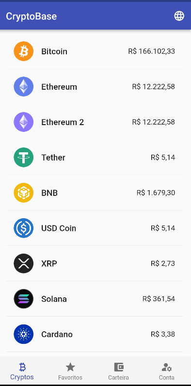

# CryptoBase

<p align="center">
    
</p>
    


## :rocket: Tecnology

-  Dart
-  Flutter
-  sqlite
-  hive
-  fl_chart
-  firebase

## 💻 About the Project

CryptoBase developed with Flutter, with the aim of studying and training skills on a complete Android application.
The app has features like consumption of Coinbase api, listing of cryptocurrencies, watchlist, wallet and much more.

### Functionalities

- [x] **Crud Firebase**: Resources synced with firebase/firestore.
- [X] **Coinbase API**: Data such as values, variations, images, names and graphics.
- [X] **Wallet Function**: A wallet to simulate operations within the App.
- [X] **Watchlist**: Add your cryptocurrencies of interest to your favorites list.
- [X] **Document Scanner**: Scan or attach your personal documents.
- [X] **Multi Coin**: Choose between Real and Dollar to make your trades.
- [x] **Navigation Bar**: Navigation bar to access other pages within the application.


## :computer_mouse: Installation and execution

Make a clone of this repository and access the directory.

```bash
$ git clone git@github.com:afonsoburginski/crypto-base.git && cd crypto-base.git
```


Install the dependencies

```Dart
# Install
$ flutter pub get

# Running the Doctor
$ flutter doctor

# Start the App
$ Flutter Run
```

## :space_invader: Contribute

Go to `fork` and clone the project from your user.

```bash
# Cloning project
$ git clone https://github.com/YOUR-USERNAME/crypto-base.git

# Create a branch
$ git branch my-change

# Accessing the new branch
$ git checkout -b my-alteration

# Adding the changed files
$ git add

# Create commit and the message
$ git commit -m "Fixing...."

# Sending changes to the brach
$ git push origin my-change
```
You should navigate to your repository where you have forked and click the *New pull request* button on the left side of the page.

## :alien: Autor
-  [Github](https://github.com/afonsoburginski/)
-  [Linkedin](https://www.linkedin.com/in/afonso-kevin-burginski-76aa05175/)
-  [Email](mailto:burginskikevin@gmail.com/)

## 📝 Licença

This project is under the MIT license. See the file [LICENSE](LICENSE.md) for more details.

